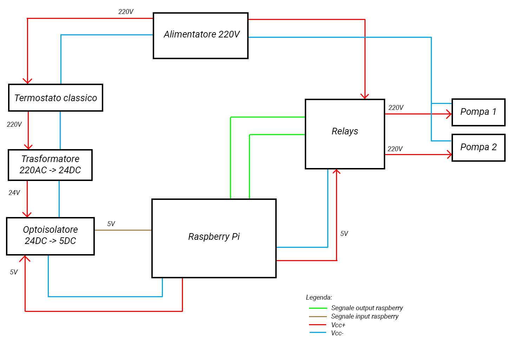

# ThermoStation

## Scopo del progetto
Questo progetto ha lo scopo di rendere domotica una parte della casa, la caldaia ed il relativo impianto di ricaldamento, che solitamente non lo è.

## Struttura del progetto
### /api
In questa cartella è contenuto il backend del progetto, il quale gestisce sia le interazioni con il Raspberry sia le interazioni con la pagina web che costituisce il frontend del progetto dal quale si possono aggiungere, modificare ed eliminare termostati e pompe controllate dal Raspberry.

- <code>server.py</code>: questo file ha lo scopo di inizializzare il backend, utilizzando Flask, e metterlo in ascolto sulla porta 5000
- <code>bot.py</code>: questo file ha il solo scopo di far interagire il backend con un bot Telegram, al solo scopo di visualizzazione. Sono esposte due comandi
   - <code>/pumps</code> che torna la lista delle pompe connese ed il relativo stato (accesa/spenta)
   - <code>/thermostats</code> che torna la lista dei termostati connesi ed il relativo stato (acceso/spento e la temperatura se termostato digitale)
- <code>app/routes.py</code>: questo file inizializza Flask e gestisce le varie API messe a disposizione dal backend per il frontend
- <code>app/models/station.py</code>: questo file contiene la classe che gestisce l'intera stazione, la quale gestice l'aggiunta, la rimozione ed il recupero delle pompe e dei termostati. La classe è implementata come una classe singleton in quanto il progetto consente di gestire una sola stazione.
- <code>app/models/pump.py</code>: questo file contiene la classe che permette la gestione completa di una pompa: impostaione del nome, del pin del Raspberry a cui è collegata, impostazione di ora di inizio/fine servizio, ecc
- <code>app/models/thermostat.py</code>: questo file contiene la classe che permette la gestione completa di un thermostato: impostazione del nome, del pin del Raspberry a cui è collegato, impostazione del tipo (classico che indica solo acceso/spento, digitale che permette la lettura della temperature), ecc
- <code>app/models/db.py</code>: questo file contiene la classe per interagire con il database influxdb nel quale vengono scritti i dati delle pompe (accesa/spenta) ogni 10 secondi e dei termostati (acceso/spento e temperatura se digitale) ogni 3 secondi
- <code>app/models/event.py</code>: questo file contiene un classe per permettere di inviare eventi per una prima gestione in cui prevedevo di utilizzare i websocket per comunicari i cambi di stato al frontend, poi abbandonato

### /thermostation
In questa cartella è contenutto il codice per la gestione del frontend, sviluppato utilizzando Angular.

- <code>src/environments/environment.ts</code>: questo file contiene alcune impostazioni utlizzate dal frontend, in particolare gli indirizzi IP per comunicare con il backend e Grafana
- <code>src/app/components/home/*</code>: in questa cartella sono contenuti i file che compongono la home page del frontend, in pratica solamente un controllo a tab per passare dalla visualizzazione delle pompe e dei termostati
- <code>src/app/components/thermostats/*</code>: questa cartella contiene il codice per visualizzare la lista dei termostati collegati alla stazione ed un pulsante per aggiungerne di nuovi
- <code>src/app/components/pumps/*</code>: questa cartella contiene il codice per visualizzare la lista delle pompe collegate alla stazione ed un pulsante per aggiungerne di nuove
- <code>src/app/components/thermostat/*</code>: questa cartella contiene il codice per gestire un singolo termostato, ad esempio cambiare le sue impostazioni quali nome, pin, tipologia e temperatura desiderata (per termostati digitali) oppure rimuoverlo
- <code>src/app/components/pump/*</code>: questa cartella contiene il codice per gestire una singola pompa, ad esempio cambiare le sue impostazioni quali nome, pin e ore di inizio/fine servizio oppure rimuoverla

## Schema dei collegamenti
